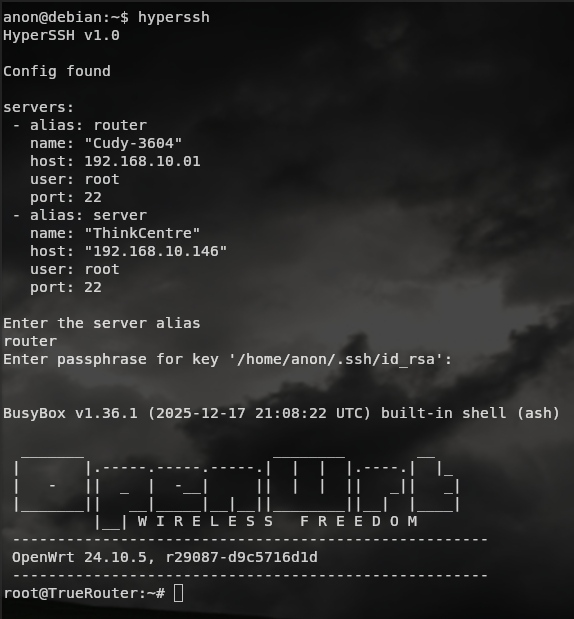

# HyperSSH

**HYPERSSH** - a simple program written in the Ruby programming language.
The program allows for quick SSH connections. 
You configure the settings once and then connect to servers rapidly using aliases.
Connect to your servers in seconds. Set up aliases once, SSH instantly.

## Configuration example
~/.ssh/servers.yaml
~~~
servers: 
 - alias: router
   name: "Samsung"
   host: 192.168.10.01
   user: root
   port: 22
 - alias: server
   name: "HP"
   host: "192.168.10.146"
   user: root
   port: 22
~~~
## installation
1. clone the repository
~~~
git clone https://github.com/Efesint/HyperSSH && cd HyperSSH
~~~
2.Make sure you have Ruby on your pc
~~~
sudo apt install ruby
~~~
3. Rename the file.
~~~ 
mv HyperSSH.rb hyperssh
~~~
4. Copy to /usr/local/bin:
~~~
sudo cp hyperssh /usr/local/bin
~~~
5. Add hyperssh executable
~~~
sudo chmod +x /usr/local/bin/hyperssh
~~~
# Mirror on codeberg and gitlab
https://codeberg.org/efesint/hyperssh
https://gitlab.com/Efesint0/HyperSSH
